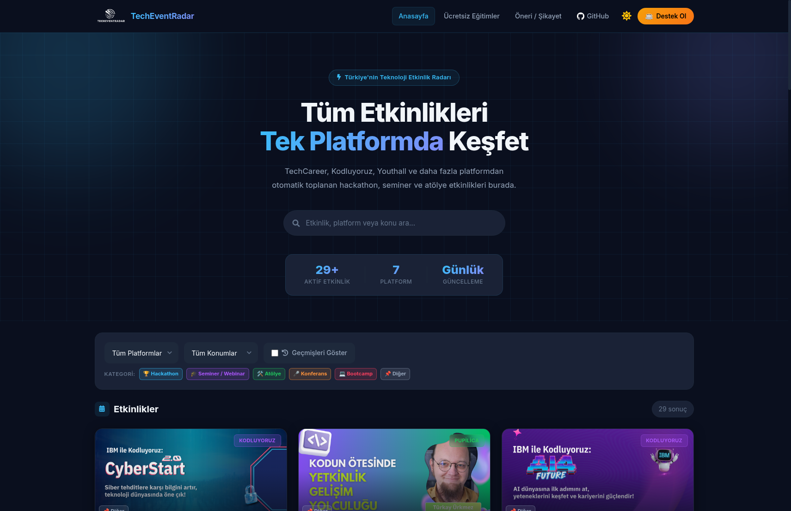

# TechEventRadar

[](https://github.com/Metrohan/eventradar.dev/actions/workflows/test.yml)
[](https://github.com/Metrohan/eventradar.dev/actions/workflows/deploy.yml)
[](LICENSE)
[](https://www.python.org/)
[](docker-compose.yml)

One-sentence goal: **Help students and recent graduates discover current technology events in one place.**

TechEventRadar collects bootcamps, webinars, hackathons, career events, and community meetups from different sources and presents them on a single screen. It helps students answer "what event is happening, when is it, where is it, and how do I apply" without checking each site one by one.


## Why This Project?

For students, the biggest problem is not a lack of information. It is fragmentation:

- Events are spread across different platforms.
- Application deadlines are easy to miss.
- Filtering free or online events takes time.

TechEventRadar was built to reduce that fragmentation.

## Key Features

- Event collection from multiple sources
- **Category tags** for Hackathon, Seminar/Webinar, Workshop, Conference, and Bootcamp events
- Search and filtering in a single event list
- Quick access to event details
- Content management through an admin panel
- Suggestion, complaint, and event submission flows
- Announcement system

**Live demo:** [eventradar.dev](https://eventradar.dev)



## Architecture

- **Backend:** FastAPI, SQLAlchemy, and PostgreSQL
- **Frontend:** React with Vite
- **Scraping:** Python scraper modules with Selenium and requests
- **Deployment:** Docker Compose

```text
Frontend (React + Vite)  ->  Backend (FastAPI)  ->  PostgreSQL
                                   |
                                   -> Source Catalog -> Scrape Run Coordinator
                                                         |
                                                         -> Event Ingestion
```

The source catalog provides canonical source definitions and lazy runner adapters. The coordinator owns retries, run metrics, reconciliation, and consecutive-failure alerts. Event ingestion centralizes date and location normalization, tags, transactions, and event lifecycle rules. See [`CONTEXT.md`](CONTEXT.md) and [`docs/adr/`](docs/adr/) for the domain language and architecture decisions.

## Quick Start With Docker

```bash
git clone https://github.com/Metrohan/eventradar.dev.git
cd eventradar.dev
cp .env.example .env
# Edit SECRET_KEY, ADMIN_USERNAME, and ADMIN_PASSWORD in .env
docker compose up -d --build
docker compose exec backend alembic upgrade head
sleep 10
curl http://localhost:8000/health
```

After the stack starts:

- Frontend: <http://localhost:3000>
- Backend API: <http://localhost:8000>
- Swagger UI: <http://localhost:8000/docs>
- Health check: <http://localhost:8000/health>

## Scrapers

| Source | Status | Fetch mode |
|--------|--------|------------|
| TechCareer | Active | Browser (Selenium) |
| Youthall | Active | Browser (Selenium) |
| Akbank Genclik | Active | Browser (UC) |
| Pupilica | Active | Browser (UC) |
| Kodluyoruz | Active | HTTP |
| Anbean | Active | HTTP |
| Coderspace | Active | Browser (UC) |
| Tech Istanbul | Active | HTTP API |

## API

- Swagger UI: <http://localhost:8000/docs>
- Health check: <http://localhost:8000/health>
- Events: `GET /api/events?page=1&page_size=20&active_only=true`
- Source catalog: `GET /api/sources`

## Local Development

### Backend

```bash
pip install -r requirements.txt
uvicorn app.main:app --reload
```

### Frontend

```bash
cd frontend
npm ci
npm run dev
```

### Tests

```bash
pip install -r requirements-dev.txt
pytest -m "not integration"
pytest -m integration
```

Integration tests use real scrapers and require Chrome.

## Run Scrapers Manually

To fetch events on demand:

```bash
docker compose run --rm scraper python scripts/run_daily_scrape.py
```

## Telegram Scraper Alerts

The scrape run coordinator sends an in-app Telegram alert after three consecutive failures for the same source:

```bash
TELEGRAM_BOT_TOKEN=<BOT_TOKEN>
TELEGRAM_CHANNEL_ID=<CHANNEL_ID>
```

The optional log monitor can report other critical errors found in backend or scraper log files:

```bash
export TELEGRAM_BOT_TOKEN="<BOT_TOKEN>"
export TELEGRAM_CHAT_ID="<CHAT_ID>"
python3 scripts/monitor_alerts.py
```

Cron example for continuous checks every 2 minutes:

```bash
*/2 * * * * cd /path/to/eventradar.dev && TELEGRAM_BOT_TOKEN=<BOT_TOKEN> TELEGRAM_CHAT_ID=<CHAT_ID> /usr/bin/python3 scripts/monitor_alerts.py >> /var/log/eventradar-alerts.log 2>&1
```

## Troubleshooting

**Port 8000 is already in use:**

```bash
lsof -i :8000
kill -9 <PID>
```

**Database connection error:**

Check that the `DATABASE_URL` value in `.env` matches the service name in `docker-compose.yml`.

**Scraper Chrome error:**

Check scraper logs through `GET /api/admin/scrapers/logs` with an admin token.

## Contributing

Contributions are valuable to the project. Small fixes can still have a large impact.

Ways to contribute:

- Add a new scraper source.
- Fix existing scraper issues.
- Improve date and location parsing accuracy.
- Improve frontend filtering and UX.
- Improve documentation and test coverage.

Contribution flow:

1. Fork this repository.
2. Create a new branch.
3. Make your change.
4. Test it.
5. Open a clear pull request.

Example:

```bash
git checkout -b feat/add-new-source
git add .
git commit -m "feat: add new event source scraper"
git push origin feat/add-new-source
```

See [CONTRIBUTING.md](CONTRIBUTING.md) for the detailed guide.

## Security and Privacy

The open-source version of this project does not include secrets or credentials. If you find a suspected security issue, please report it through [SECURITY.md](SECURITY.md).

## Roadmap

> **Long-term vision:** Transform TechEventRadar from a Turkey-focused aggregator into a global platform — one place where developers worldwide can discover tech events from any country.

### Phase 1 — Foundation ✅ (Done)
- [x] Automated event aggregation from multiple sources (8 sources)
- [x] Category tag system (Hackathon, Bootcamp, Seminar…)
- [x] Admin panel and content management
- [x] Telegram notification system
- [x] CI/CD pipeline and test infrastructure

### Phase 2 — Quality & Reliability 🔧 (In progress)
- [ ] New Turkish sources: Skillcamp/Patika, Komunite
- [x] Retry mechanism and error handling for scrapers
- [x] Per-source quality metrics (success rate, data completeness)
- [x] Location normalization (Online / city-based)
- [x] Auto-archiving of past events

### Phase 3 — Product Growth 🚀 (Near-term)
- [ ] User accounts and personalized event recommendations
- [ ] Email / browser push notification subscriptions
- [x] RSS feed subscriptions
- [x] Advanced search and filtering (city, date range, price)
- [x] Calendar view
- [x] Mobile-friendly PWA

### Phase 4 — Internationalization 🌍 (Long-term)
- [ ] Multi-language UI (TR / EN)
- [ ] Country and region filtering
- [ ] International source integrations (Eventbrite, Luma, Devpost…)
- [ ] Adapter architecture that can pull events from any country
- [ ] Global event map

## License

MIT License: [LICENSE](LICENSE)

---

This project helps students reach opportunities faster. A good event can sometimes change the direction of a career.

---

## Sponsorship

TechEventRadar is completely free and open source. We rely on community support to cover domain and hosting costs.

> If you find this project useful, consider buying us a coffee to help keep it running.

[](https://buymeacoffee.com/metehangnn)
[](https://github.com/sponsors/Metrohan)

**Where does it go?**
- `eventradar.dev` domain renewal (~1,000 TL/year)
- Server hosting costs

---

## Contributors

Thanks to everyone who contributed to this project! This list is auto-updated on every push to main by [contributors-readme-action](https://github.com/akhilmhdh/contributors-readme-action).

<!-- readme: contributors -start -->
<table>
	<tbody>
		<tr>
            <td align="center">
                <a href="https://github.com/Metrohan">
                    
                    <br />
                    <sub><b>Metrohan</b></sub>
                </a>
            </td>
            <td align="center">
                <a href="https://github.com/4ykutG">
                    
                    <br />
                    <sub><b>4ykutG</b></sub>
                </a>
            </td>
            <td align="center">
                <a href="https://github.com/onurege3467">
                    
                    <br />
                    <sub><b>onurege3467</b></sub>
                </a>
            </td>
            <td align="center">
                <a href="https://github.com/aqilaziz">
                    
                    <br />
                    <sub><b>aqilaziz</b></sub>
                </a>
            </td>
            <td align="center">
                <a href="https://github.com/blut-agent">
                    
                    <br />
                    <sub><b>Blut-agent</b></sub>
                </a>
            </td>
            <td align="center">
                <a href="https://github.com/rashmitha-j">
                    
                    <br />
                    <sub><b>rashmitha-j</b></sub>
                </a>
            </td>
		</tr>
	<tbody>
</table>
<!-- readme: contributors -end -->
