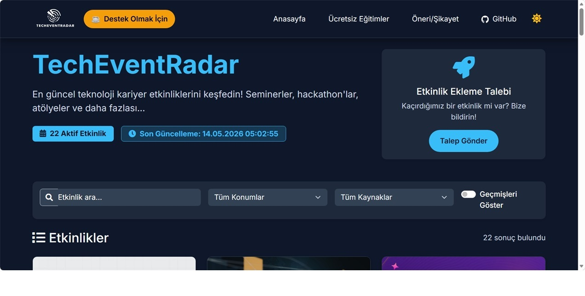

# TechEventRadar

Tek cümle amaç: **Öğrencilerin ve yeni mezunların güncel teknoloji etkinliklerini tek yerde kolayca bulması.**

TechEventRadar; bootcamp, webinar, hackathon, kariyer etkinliği ve topluluk buluşmalarını farklı kaynaklardan toplayıp tek bir ekranda sunar. Böylece öğrenciler "hangi etkinlik ne zaman, nerede, nasıl başvurulur" sorularını tek tek siteleri gezmeden yanıtlayabilir.


## Neden Bu Proje?

Öğrenciler için en büyük problem bilgiden çok **dağınıklık**:

- Etkinlikler farklı platformlara dağılmış durumda
- Son başvuru tarihleri kolayca kaçırılıyor
- Ücretsiz/online etkinlikleri filtrelemek zaman alıyor

TechEventRadar bu dağınıklığı azaltmak için geliştirildi.

## Öne Çıkan Özellikler

- Çoklu kaynaklardan etkinlik toplama
- Tek listede arama ve filtreleme
- Etkinlik detayına hızlı erişim
- Admin paneli ile içerik yönetimi
- Öneri/şikayet ve etkinlik ekleme talepleri
- Duyuru sistemi



## Mimari

- **Backend:** FastAPI + SQLAlchemy + PostgreSQL
- **Frontend:** React (Vite)
- **Scraping:** Python tabanlı scraper modülleri
- **Deployment:** Docker Compose

## Hızlı Başlangıç

### 1) Projeyi klonla

```bash
git clone https://github.com/Metrohan/eventradar.dev.git
cd eventradar.dev
```

### 2) Ortam değişkenlerini hazırla

```bash
cp .env.example .env
```

`.env` içindeki değerleri kendi ortamına göre düzenle.

### 3) Docker ile çalıştır

```bash
docker compose up -d --build
```

### 4) Uygulamayı aç

- Frontend: `http://localhost:3000`
- Backend: `http://localhost:8000`
- API Docs: `http://localhost:8000/docs`

## Geliştirme (Local)

### Backend

```bash
pip install -r requirements.txt
uvicorn app.main:app --reload
```

### Frontend

```bash
cd frontend
npm install
npm run dev
```

## Katkı Sağlama

Katkıların proje için çok değerli. Küçük düzeltmeler bile büyük etki oluşturur.

### Nasıl katkı verebilirsin?

- Yeni scraper kaynağı eklemek
- Mevcut scraper hatalarını düzeltmek
- Tarih/konum ayrıştırma doğruluğunu artırmak
- Frontend filtreleme ve UX iyileştirmeleri
- Dokümantasyon ve test kapsamını geliştirmek

### Adım adım katkı akışı

1. Bu repoyu fork et
2. Yeni bir branch aç
3. Değişikliğini yap
4. Test et
5. Açıklayıcı bir Pull Request gönder

Örnek:

```bash
git checkout -b feat/add-new-source
git add .
git commit -m "feat: add new event source scraper"
git push origin feat/add-new-source
```

Daha detaylı rehber için: [CONTRIBUTING.md](CONTRIBUTING.md)

## Güvenlik ve Gizlilik

Bu proje açık kaynak sürümde secret/credential içermez. Şüpheli bir güvenlik problemi görürsen lütfen [SECURITY.md](SECURITY.md) üzerinden bildir.

## Yol Haritası

- Kaynak sayısını artırmak
- Daha sağlam tarih normalizasyonu
- Kalite metrikleri (kaynak bazlı başarı oranı)
- Öğrenci dostu kişiselleştirilmiş öneri sistemi

## Lisans

MIT Lisansı: [LICENSE](LICENSE)

---

Bu proje öğrencilerin fırsatlara daha hızlı ulaşabilmesi için geliştiriliyor. İyi bir etkinlik bazen kariyerin yönünü değiştirir.
